# 📋 Análisis Completo del Proyecto: infra-bancaria-terraform

## 🎯 Resumen Ejecutivo

Este proyecto contiene la **infraestructura como código (IaC)** para un ecosistema bancario en AWS, utilizando **Terraform**. Define todos los recursos de red, contenedores, permisos y automatización necesarios para desplegar múltiples aplicaciones bancarias en la nube.

---

## 🏗️ Arquitectura General


---

## 📁 Estructura del Proyecto

| Archivo | Propósito |
|---------|-----------|
| [provider.tf](file:///c:/proyecto-bancario-devops/provider.tf) | Configuración del proveedor AWS |
| [backend.tf](file:///c:/proyecto-bancario-devops/backend.tf) | Estado remoto en S3 con lock en DynamoDB |
| [vpc.tf](file:///c:/proyecto-bancario-devops/vpc.tf) | Red virtual y subnets |
| [routes.tf](file:///c:/proyecto-bancario-devops/routes.tf) | Tablas de enrutamiento y NAT Gateway |
| [ecr.tf](file:///c:/proyecto-bancario-devops/ecr.tf) | Repositorios de contenedores Docker |
| [iam.tf](file:///c:/proyecto-bancario-devops/iam.tf) | Roles y permisos para EKS/Fargate |
| [variables.tf](file:///c:/proyecto-bancario-devops/variables.tf) | Variables del proyecto (vacío actualmente) |
| [terraform.yml](file:///c:/proyecto-bancario-devops/.github/workflows/terraform.yml) | CI/CD con GitHub Actions |

---

## 📄 Análisis Detallado de Cada Archivo

### 1️⃣ provider.tf - Proveedor de AWS

```hcl
terraform {
  required_providers {
    aws = {
      source  = "hashicorp/aws"
      version = "~> 5.0"
    }
  }
}

provider "aws" {
  region = "us-east-2"
}
```

| Aspecto | Detalle |
|---------|---------|
| **Proveedor** | AWS (HashiCorp oficial) |
| **Versión** | 5.x (última mayor estable) |
| **Región** | `us-east-2` (Ohio, USA) |
| **Propósito** | Definir qué proveedor cloud usar y en qué región |

---

### 2️⃣ backend.tf - Estado Remoto

Este archivo configura dónde Terraform guarda el "estado" de la infraestructura:

```hcl
terraform {
  backend "s3" {
    bucket         = "banca-ecosistema-tfstate-512be32e" 
    key            = "infra/terraform.tfstate"           
    region         = "us-east-2"                         
    dynamodb_table = "terraform-lock-table"              
    encrypt        = true                                
  }
}
```

**Recursos creados:**

| Recurso | Nombre | Propósito |
|---------|--------|-----------|
| **S3 Bucket** | `banca-ecosistema-tfstate-512be32e` | Almacenar el archivo de estado |
| **DynamoDB Table** | `terraform-lock-table` | Prevenir conflictos cuando múltiples personas ejecutan Terraform |
| **random_id** | - | Genera IDs únicos (4 bytes) |

> [!IMPORTANT]
> El bucket tiene `prevent_destroy = true` para evitar eliminación accidental del estado.

---

### 3️⃣ vpc.tf - Red Virtual Privada

Define la red donde vivirán todos los servicios:


| Recurso | CIDR | Zona | Uso |
|---------|------|------|-----|
| **VPC** | `10.0.0.0/16` | - | Red principal (65,536 IPs) |
| **public-1a** | `10.0.1.0/24` | us-east-2a | Load balancers públicos |
| **public-1b** | `10.0.2.0/24` | us-east-2b | Load balancers públicos |
| **private-1a** | `10.0.10.0/24` | us-east-2a | Microservicios internos |
| **private-1b** | `10.0.11.0/24` | us-east-2b | Microservicios internos |
| **Internet Gateway** | - | - | Conexión a internet |

> [!TIP]
> Las subnets tienen tags de Kubernetes (`kubernetes.io/role/elb`) para integración con EKS.

---

### 4️⃣ routes.tf - Enrutamiento de Red

Configura cómo fluye el tráfico de red:

```mermaid
graph TD
    Internet((Internet))
    IGW[Internet Gateway]
    NAT[NAT Gateway]
    
    Internet <--> IGW
    IGW <--> PUB["Subnets Públicas<br/>Tráfico bidireccional"]
    PUB --> NAT
    NAT --> PRIV["Subnets Privadas<br/>Solo salida a internet"]
```



**Recursos:**

| Recurso | Propósito |
|---------|-----------|
| **Elastic IP** | IP estática para el NAT Gateway |
| **NAT Gateway** | Permite que las subnets privadas accedan a internet (solo salida) |
| **Route Table Pública** | Enruta `0.0.0.0/0` → Internet Gateway |
| **Route Table Privada** | Enruta `0.0.0.0/0` → NAT Gateway |

> [!NOTE]
> El NAT Gateway permite que los microservicios en subnets privadas descarguen dependencias y se comuniquen con APIs externas, sin estar expuestos directamente a internet.

---

### 5️⃣ ecr.tf - Repositorios de Contenedores

Define los repositorios Docker para las imágenes de los microservicios:

```hcl
variable "repo_names" {
  default = ["arcbank", "bantec", "nexus", "ecusol", "digiconecu-switch"]
}
```

| Repositorio | Descripción |
|-------------|-------------|
| **arcbank** | Banco ArcBank |
| **bantec** | Banco Bantec |
| **nexus** | Banco Nexus |
| **ecusol** | Banco Ecusol |
| **digiconecu-switch** | Switch interbancario DIGICONECU |

**Configuración:**
- ✅ `image_tag_mutability = MUTABLE` - Permite sobrescribir tags
- ✅ `scan_on_push = true` - Escanea vulnerabilidades automáticamente

---

### 6️⃣ iam.tf - Roles y Permisos

Define los permisos necesarios para EKS y Fargate:


| Rol | Servicio Asumido | Políticas | Uso |
|-----|------------------|-----------|-----|
| **eks-cluster-role-bancario** | `eks.amazonaws.com` | EKSClusterPolicy | Permite a EKS gestionar el clúster |
| **fargate-execution-role-bancario** | `eks-fargate-pods.amazonaws.com` | FargatePodExecution, CloudWatch | Permite ejecutar pods serverless y enviar logs |

---

### 7️⃣ variables.tf - Variables

> [!NOTE]
> Este archivo está actualmente **vacío**. Las variables se definen inline en otros archivos (como `repo_names` en `ecr.tf`).

---

### 8️⃣ .github/workflows/terraform.yml - CI/CD

Pipeline de automatización con GitHub Actions:

```yaml
name: "Terraform Infraestructura"

on:
  push:
    branches: [main, desarrollo]
  pull_request:
    branches: [main]
```

**Flujo de trabajo:**

| Paso | Acción | Condición |
|------|--------|-----------|
| 1 | Checkout código | Siempre |
| 2 | Setup Terraform | Siempre |
| 3 | `terraform init` | Siempre |
| 4 | `terraform plan` | Siempre |
| 5 | `terraform apply` | Solo en push a `main` |

> [!CAUTION]
> El `apply` solo se ejecuta en merges a `main`. Los PRs solo ejecutan `plan` para revisar cambios.

**Secretos requeridos:**
- `AWS_ACCESS_KEY_ID`
- `AWS_SECRET_ACCESS_KEY`

---

## 🔐 Archivos Ignorados (.gitignore)

```
.terraform/           # Cache local de providers
.terraform.lock.hcl   # Archivo de lock de dependencias
*.tfstate             # Estado de Terraform (sensible)
*.tfstate.backup      # Backups del estado
*.tfvars              # Variables con secretos
```

---

## 🌐 Contexto del Ecosistema Bancario

Este proyecto de infraestructura soporta un **ecosistema de banca core** con:

| Componente | Descripción |
|------------|-------------|
| **4 Bancos** | ArcBank, Bantec, Nexus, Ecusol |
| **1 Switch** | DIGICONECU - Procesador de transferencias interbancarias |
| **Arquitectura** | Microservicios en contenedores |
| **Orquestación** | Amazon EKS con Fargate (serverless) |
| **Red** | VPC aislada con subnets públicas/privadas |

---

## 📊 Resumen de Recursos AWS

| Tipo | Cantidad | Nombres |
|------|----------|---------|
| VPC | 1 | vpc-ecosistema-bancario |
| Subnets | 4 | 2 públicas + 2 privadas |
| Internet Gateway | 1 | main-igw |
| NAT Gateway | 1 | main-nat-gateway |
| Elastic IP | 1 | nat-static-ip |
| Route Tables | 2 | public + private |
| ECR Repositories | 5 | arcbank, bantec, nexus, ecusol, digiconecu-switch |
| IAM Roles | 2 | EKS cluster + Fargate execution |
| S3 Bucket | 1 | banca-ecosistema-tfstate-* |
| DynamoDB Table | 1 | terraform-lock-table |

---

## 🚀 Cómo Usar Este Proyecto

### Prerequisitos
```powershell
# Instalar Terraform
winget install HashiCorp.Terraform

# Configurar AWS CLI
aws configure
```

### Comandos Básicos
```powershell
# Inicializar Terraform
terraform init

# Ver cambios pendientes
terraform plan

# Aplicar cambios
terraform apply

# Destruir infraestructura (¡cuidado!)
terraform destroy
```

---

> **Documento generado:** 2026-01-14  
> **Proyecto:** [proyecto-bancario-devops](file:///c:/proyecto-bancario-devops)
