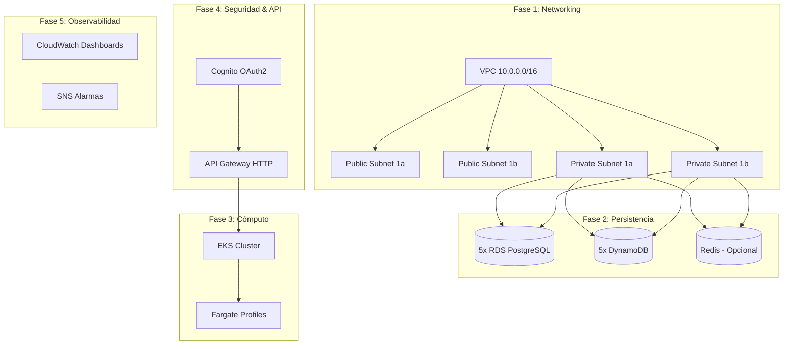
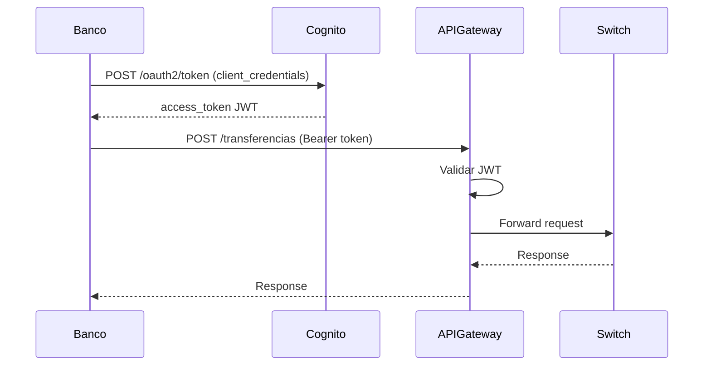

# 🏦 Infraestructura Bancaria AWS - Análisis Completo

> **Proyecto:** infra-bancaria-terraform  
> **Región:** us-east-2 (Ohio)  
> **Ambiente:** dev  
> **Fecha:** 2026-02-07

---

## 📋 Resumen Ejecutivo

Esta infraestructura soporta un **ecosistema bancario de 4 bancos** (ArcBank, Bantec, Nexus, Ecusol) conectados a través de un **Switch DIGICONECU** para transferencias interbancarias.

### Entidades del Ecosistema
| Entidad | Base de Datos | Propósito |
|---------|--------------|-----------|
| **ArcBank** | db_arcbank_core | Banco Core #1 |
| **Bantec** | db_bantec_core | Banco Core #2 |
| **Nexus** | db_nexus_core | Banco Core #3 |
| **Ecusol** | db_ecusol_core | Banco Core #4 |
| **Switch** | db_switch_ledger | Orquestador de transferencias interbancarias |

---

## 🏗️ Arquitectura por Fases



---

## 📦 Módulo 1: Networking

**Propósito:** Crear la red privada virtual que aísla y protege todos los recursos bancarios.

### Recursos Creados

| Recurso | Nombre | CIDR/Configuración | Propósito |
|---------|--------|-------------------|-----------|
| **VPC** | vpc-ecosistema-bancario | 10.0.0.0/16 | Red principal aislada |
| **Subnet Pública 1** | public-1a | 10.0.1.0/24 (us-east-2a) | Load Balancers, NAT Gateway |
| **Subnet Pública 2** | public-1b | 10.0.2.0/24 (us-east-2b) | Alta disponibilidad |
| **Subnet Privada 1** | private-1a | 10.0.10.0/24 (us-east-2a) | Microservicios, RDS |
| **Subnet Privada 2** | private-1b | 10.0.11.0/24 (us-east-2b) | Alta disponibilidad |
| **Internet Gateway** | main-igw | - | Salida a internet |
| **DB Subnet Group** | bancario-db-subnet-group | Subnets privadas | Grupo para RDS |

### Security Groups

| Security Group | Puerto(s) | Origen | Propósito |
|---------------|----------|--------|-----------|
| **rds-bancario-sg** | 5432 (PostgreSQL) | VPC CIDR | Protege las bases de datos |
| **apim-vpc-link-sg** | Egress all | - | Conecta API Gateway con backend |
| **backend-internal-sg** | 80, 8080 | Solo VPC Link SG | Protege microservicios |

### ¿Por qué se creó?
- **Aislamiento de datos bancarios** en subnets privadas sin acceso público
- **Alta disponibilidad** con 2 zonas de disponibilidad
- **Segmentación de red** separando backends de bases de datos

---

## 📦 Módulo 2: IAM

**Propósito:** Gestionar permisos y roles para servicios AWS y CI/CD.

### Roles Creados

| Rol | Servicio | Políticas Adjuntas | Propósito |
|-----|----------|-------------------|-----------|
| **eks-cluster-role-bancario** | EKS | AmazonEKSClusterPolicy | Permite al clúster EKS gestionar recursos |
| **fargate-execution-role-bancario** | Fargate | AmazonEKSFargatePodExecutionRolePolicy, CloudWatchAgentServerPolicy | Ejecutar pods en Fargate con logs |

### Usuario CI/CD

| Recurso | Nombre | Propósito |
|---------|--------|-----------|
| **Usuario IAM** | github-actions-deployer | Para workflows de GitHub Actions |
| **Política ECR** | CICD-ECR-Push | Push de imágenes Docker a ECR |
| **Política EKS** | CICD-EKS-Deploy | Describe/List clusters para kubectl |
| **Secreto** | github-actions-deployer-credentials | Credenciales en Secrets Manager |

### ¿Por qué se creó?
- **Principio de mínimo privilegio** - cada servicio tiene solo los permisos necesarios
- **Automatización CI/CD** - los desarrolladores pueden hacer deploy automático
- **Seguridad** - credenciales almacenadas en Secrets Manager, no en código

---

## 📦 Módulo 3: Storage

**Propósito:** Almacenar imágenes Docker y archivos estáticos de los frontends.

### Repositorios ECR (29 total)

| Dominio | Microservicios | Cantidad |
|---------|---------------|----------|
| **Switch** | switch-gateway-internal, switch-ms-nucleo, switch-ms-contabilidad, switch-ms-compensacion, switch-ms-devolucion, switch-ms-directorio | 6 |
| **Bantec** | bantec-gateway-server, bantec-service-clientes, bantec-service-cuentas, bantec-service-transacciones, bantec-service-sucursales | 5 |
| **ArcBank** | arcbank-gateway-server, arcbank-service-clientes, arcbank-service-cuentas, arcbank-service-transacciones, arcbank-service-sucursales | 5 |
| **Nexus** | nexus-gateway, nexus-ms-clientes, nexus-cbs, nexus-ms-transacciones, nexus-ms-geografia, nexus-web-backend, nexus-ventanilla-backend | 7 |
| **Ecusol** | ecusol-gateway-server, ecusol-ms-clientes, ecusol-ms-cuentas, ecusol-ms-transacciones, ecusol-ms-geografia, ecusol-web-backend, ecusol-ventanilla-backend | 7 |

### Buckets S3 (9 total)

| Bucket | Propósito |
|--------|-----------|
| switch-admin-panel | Panel de administración del Switch |
| bantec-web-client, bantec-ventanilla-app | Frontends de Bantec |
| arcbank-web-client, arcbank-ventanilla-app | Frontends de ArcBank |
| nexus-web-client, nexus-ventanilla-app | Frontends de Nexus |
| ecusol-web-client, ecusol-ventanilla-app | Frontends de Ecusol |

**Configuración de seguridad S3:**
- ✅ Encriptación AES256 server-side
- ✅ Acceso público bloqueado
- ✅ ACLs bloqueadas

### ¿Por qué se creó?
- **ECR**: Almacenar imágenes Docker de todos los microservicios con escaneo de vulnerabilidades
- **S3**: Hosting de aplicaciones web estáticas (SPA React/Angular)

---

## 📦 Módulo 4: Databases

**Propósito:** Bases de datos para persistencia transaccional y NoSQL.

### RDS PostgreSQL (5 instancias)

| Instancia | Base de Datos | Tipo | Almacenamiento |
|-----------|--------------|------|----------------|
| rds-arcbank | db_arcbank_core | db.t3.micro | 20 GB |
| rds-bantec | db_bantec_core | db.t3.micro | 20 GB |
| rds-nexus | db_nexus_core | db.t3.micro | 20 GB |
| rds-ecusol | db_ecusol_core | db.t3.micro | 20 GB |
| rds-switch | db_switch_ledger | db.t3.micro | 20 GB |

**Configuración:**
- ✅ PostgreSQL 17.6
- ✅ Encriptación en reposo
- ✅ Sin acceso público
- ✅ Contraseñas en Secrets Manager (rds-secret-{entidad}-v2)

### DynamoDB (5 tablas)

| Tabla | Partition Key | Propósito |
|-------|--------------|-----------|
| switch-directorio-instituciones | institucion_id | Directorio de bancos conectados al Switch |
| arcbank-sucursales-geo | sucursal_id | Ubicaciones de sucursales ArcBank |
| bantec-sucursales-geo | sucursal_id | Ubicaciones de sucursales Bantec |
| nexus-sucursales-geo | sucursal_id | Ubicaciones de sucursales Nexus |
| ecusol-sucursales-geo | sucursal_id | Ubicaciones de sucursales Ecusol |

**Configuración:** PAY_PER_REQUEST (sin costo cuando no hay actividad)

### ElastiCache Redis (Opcional)

| Recurso | Configuración | Estado |
|---------|--------------|--------|
| switch-redis | cache.t3.micro | **Deshabilitado** (elasticache_enabled = false) |

**Propósito:** Caché para el Switch (ahorra ~$50/mes cuando está apagado)

### ¿Por qué se creó?
- **RDS**: Transacciones ACID, datos financieros críticos
- **DynamoDB**: Datos geográficos de alta velocidad sin necesidad de joins
- **Redis**: Caché de sesiones y respuestas frecuentes

---

## 📦 Módulo 5: Messaging

**Propósito:** Comunicación asíncrona entre bancos a través del Switch.

### Amazon MQ (RabbitMQ)

| Recurso | Configuración |
|---------|--------------|
| **Broker** | switch-rabbitmq |
| **Engine** | RabbitMQ 3.13 |
| **Tipo** | mq.t3.micro (~$25/mes) |
| **Deployment** | SINGLE_INSTANCE |
| **Acceso** | Público (TLS) |
| **Usuario** | mqadmin |
| **Credenciales** | rabbitmq-credentials (Secrets Manager) |

### Colas Típicas del Sistema

```
switch.transferencias.entrantes     → Transferencias recibidas de los bancos
switch.transferencias.validadas    → Transferencias validadas por el Switch
switch.transferencias.compensadas  → Transferencias listas para compensación
banco.{nombre}.notificaciones      → Notificaciones al banco específico
```

### ¿Por qué se creó?
- **Desacoplamiento**: Los bancos envían transferencias sin esperar respuesta síncrona
- **Resiliencia**: Si un banco está caído, los mensajes esperan en cola
- **Trazabilidad**: Cada mensaje tiene ID único para auditoría

---

## 📦 Módulo 6: Compute (EKS + Fargate)

**Propósito:** Ejecutar microservicios en Kubernetes sin gestionar servidores.

### Estado Actual
⚠️ **EKS está DESHABILITADO** (eks_enabled = false) para ahorrar costos

### Configuración cuando está habilitado

| Recurso | Configuración |
|---------|--------------|
| **Cluster** | eks-banca-ecosistema |
| **Versión K8s** | 1.29 |
| **Logs habilitados** | api, audit |
| **Retención logs** | 7 días |

### Fargate Profiles

| Profile | Namespace | Selector | Propósito |
|---------|-----------|----------|-----------|
| default | default | app=* | Pods del namespace default |
| kube-system | kube-system | - | Componentes de Kubernetes |
| switch | switch-namespace | - | Microservicios del Switch |
| bancos | banco-namespace | - | Microservicios de bancos |

### Add-ons Configurados
- CoreDNS (DNS interno)
- VPC CNI (Networking de pods)
- kube-proxy (Routing interno)
- AWS Load Balancer Controller (ALB/NLB)

### ¿Por qué se creó?
- **Serverless**: Sin EC2 que administrar, pago por uso
- **Escalabilidad**: Kubernetes escala automáticamente
- **Aislamiento**: Cada banco en su namespace

---

## 📦 Módulo 7: Security & Identity (Cognito)

**Propósito:** Autenticación OAuth2 para comunicación Machine-to-Machine.

### Cognito User Pool

| Recurso | Configuración |
|---------|--------------|
| **Pool** | banca-ecosistema-pool-dev |
| **Dominio** | auth-banca-digiconecu-dev-{suffix} |
| **Flujo OAuth** | client_credentials (M2M) |

### Resource Server

| API | Scope | Descripción |
|-----|-------|-------------|
| https://switch-api.com | transfers.write | Permite ejecutar transferencias |

### Clientes OAuth2 (4 bancos)

| Cliente | Tipo | Scope |
|---------|------|-------|
| arcbank-System-Client | Confidential | transfers.write |
| bantec-System-Client | Confidential | transfers.write |
| nexus-System-Client | Confidential | transfers.write |
| ecusol-System-Client | Confidential | transfers.write |

### Flujo de Autenticación



### Secretos Generados

| Secreto | Propósito |
|---------|-----------|
| switch/internal-api-secret-dev | Firma interna de requests |

### ¿Por qué se creó?
- **Seguridad**: Cada banco tiene credenciales únicas
- **Estándar OAuth2**: Interoperabilidad y renovación automática de tokens
- **Auditoría**: Cada request tiene identidad del banco

---

## 📦 Módulo 8: Observability

**Propósito:** Monitorear la salud del ecosistema y alertar problemas.

### CloudWatch Dashboards

| Dashboard | Métricas |
|-----------|---------|
| **Banca-Overview-dev** | API Gateway requests, latencia, errores; RDS CPU y conexiones; RabbitMQ mensajes |
| **ArcBank-Metrics-dev** | RDS CPU y storage de ArcBank |
| **Switch-Metrics-dev** | RDS Switch, RabbitMQ, API Gateway transferencias |

### Alarmas CloudWatch

| Alarma | Métrica | Umbral | Acción |
|--------|--------|--------|--------|
| RDS-Switch-High-CPU | CPUUtilization | >50% por 10 min | SNS Notification |
| APIGateway-5xx-Errors | 5xx | >2 en 15 min | SNS Notification |
| APIGateway-High-Latency | Latency p95 | >2000ms | SNS Notification |
| RabbitMQ-Messages-Queued | MessageCount | >5 mensajes | SNS Notification |

### SNS Topic

| Topic | Suscriptor |
|-------|-----------|
| banca-alarms-dev | awsproyecto26@gmail.com |

### ¿Por qué se creó?
- **Visibilidad operacional**: Ver estado en tiempo real
- **Alertas proactivas**: Detectar problemas antes que los usuarios
- **Debugging**: Logs centralizados para troubleshooting

---

## 📦 Módulo 9: API Gateway

**Propósito:** Punto de entrada único para todas las transacciones del Switch.

### Configuración

| Recurso | Valor |
|---------|-------|
| **Tipo** | HTTP API (v2) |
| **Nombre** | apim-switch-gateway |
| **Stage** | dev (auto-deploy) |
| **URL** | https://{api-id}.execute-api.us-east-2.amazonaws.com/dev |

### Rate Limiting

| Configuración | Valor |
|--------------|-------|
| Throttling Rate | 50 req/s |
| Burst Limit | 100 req |

### CORS

```json
{
  "allow_origins": ["*"],
  "allow_methods": ["GET", "POST", "PUT", "DELETE", "OPTIONS"],
  "allow_headers": ["Content-Type", "Authorization", "X-JWS-Signature", "X-Trace-ID"]
}
```

### VPC Link
Conecta el API Gateway con los microservicios en las subnets privadas.

### Logging

| Destino | Campos |
|---------|--------|
| CloudWatch | requestId, sourceIp, httpMethod, status, latency, integrationError |

### ¿Por qué se creó?
- **Punto de entrada único**: Una URL para todo el switch
- **Seguridad**: Solo tráfico autorizado pasa al backend
- **Throttling**: Protección contra ataques DDoS

---

## 💰 Costos Estimados (Ambiente Dev)

| Servicio | Estado | Costo/mes |
|----------|--------|-----------|
| RDS (5x t3.micro) | ⏸️ Stopped | ~$0 (cuando stopped) |
| Amazon MQ (t3.micro) | ✅ Running | ~$25 |
| API Gateway | ✅ Running | ~$1-5 (por requests) |
| S3 | ✅ Running | ~$1 |
| ECR | ✅ Running | ~$1 |
| Secrets Manager | ✅ Running | ~$3 (8 secretos) |
| CloudWatch | ✅ Running | ~$2-5 |
| EKS + NAT | ❌ Disabled | $0 (ahorrado ~$100/mes) |
| ElastiCache | ❌ Disabled | $0 (ahorrado ~$50/mes) |

**Total estimado (dev):** ~$35-45/mes

---

## ⚠️ Elementos Faltantes o Por Considerar

### Alta Prioridad

| Elemento | Descripción | Recomendación |
|----------|-------------|---------------|
| 🔴 **Multi-AZ RDS** | RDS está en single-AZ | Habilitar para producción |
| 🔴 **Backups automatizados** | retention_period no configurado | Configurar 7+ días |
| 🔴 **WAF** | Sin firewall de aplicaciones | Agregar AWS WAF al API Gateway |
| 🔴 **CloudFront** | Sin CDN | Agregar para S3 frontends |

### Media Prioridad

| Elemento | Descripción | Recomendación |
|----------|-------------|---------------|
| 🟡 **Route 53** | Sin dominio personalizado | Configurar DNS para API Gateway |
| 🟡 **ACM Certificate** | Sin SSL/TLS custom | Crear certificado para dominio propio |
| 🟡 **VPN/Direct Connect** | Acceso solo por internet | Para conexión on-premise |
| 🟡 **Secrets Rotation** | Rotación manual | Configurar rotación automática |

### Baja Prioridad (Nice to Have)

| Elemento | Descripción |
|----------|-------------|
| 🟢 **X-Ray** | Tracing distribuido |
| 🟢 **Parameter Store** | Configuración por ambiente |
| 🟢 **EventBridge** | Eventos entre servicios |
| 🟢 **Step Functions** | Orquestación de workflows |

---

## 📁 Estructura del Proyecto

```
proyecto-bancario-devops/
├── main.tf                    # Orquestador de módulos
├── variables.tf               # Variables globales
├── outputs.tf                 # Outputs de todos los módulos
├── provider.tf                # Configuración AWS
├── backend.tf                 # Estado remoto en S3
├── modules/
│   ├── networking/            # VPC, Subnets, Security Groups
│   ├── iam/                   # Roles y usuario CI/CD
│   ├── storage/               # ECR y S3
│   ├── databases/             # RDS, DynamoDB, ElastiCache
│   ├── messaging/             # Amazon MQ (RabbitMQ)
│   ├── compute/               # EKS + Fargate
│   ├── security-certs/        # Cognito OAuth2
│   ├── observability/         # CloudWatch, SNS
│   └── api-gateway/           # HTTP API Gateway
├── k8s-manifests/             # Manifiestos Kubernetes
├── scripts/                   # Scripts auxiliares
└── .github/workflows/         # CI/CD con GitHub Actions
```

---

## 🚀 Comandos Útiles

```bash
# Configurar kubectl (cuando EKS esté habilitado)
aws eks update-kubeconfig --region us-east-2 --name eks-banca-ecosistema

# Ver outputs de Terraform
terraform output

# Ver secretos de RDS
aws secretsmanager get-secret-value --secret-id rds-secret-switch-v2 --query SecretString --output text

# Ver credenciales RabbitMQ
aws secretsmanager get-secret-value --secret-id rabbitmq-credentials --query SecretString --output text

# Ver credenciales CI/CD
aws secretsmanager get-secret-value --secret-id github-actions-deployer-credentials --query SecretString --output text
```

---

## ✅ Conclusión

La infraestructura está bien diseñada para un **proyecto académico/desarrollo** con:
- ✅ Modularización correcta
- ✅ Seguridad básica implementada
- ✅ Optimización de costos (EKS/ElastiCache deshabilitables)
- ✅ CI/CD preparado
- ✅ Observabilidad configurada

Para **producción**, considerar agregar los elementos de "Alta Prioridad" listados arriba.
