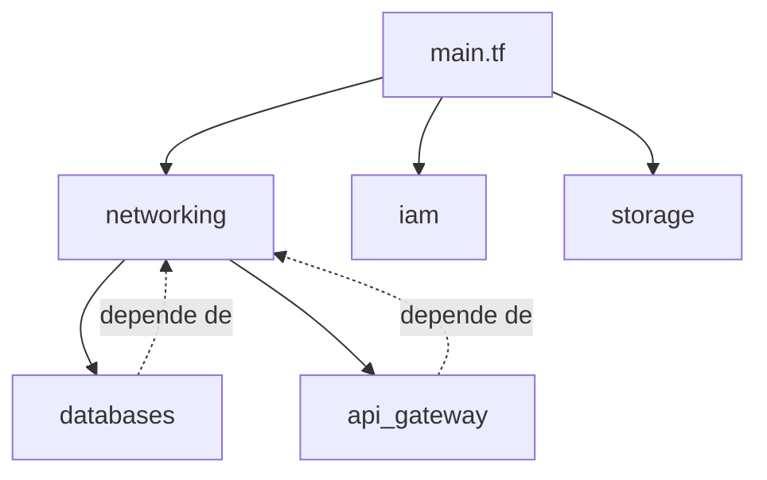

# 📁 Estructura de Módulos - Infraestructura Bancaria

Este proyecto ha sido reorganizado en módulos de Terraform para mejor mantenibilidad y reusabilidad.

## 🏗️ Estructura de Directorios

```
proyecto-bancario-devops/
├── .github/              # CI/CD workflows (sin cambios)
├── main.tf               # ⭐ Orquestador principal que llama a los módulos
├── provider.tf           # Configuración del provider AWS
├── backend.tf            # Backend remoto (S3 + DynamoDB)
├── variables.tf          # Variables globales
├── outputs.tf            # Outputs globales
└── modules/
    ├── networking/       # VPC, Subnets, NAT Gateway, Security Groups
    ├── iam/              # Roles para EKS y Fargate
    ├── storage/          # ECR y S3 buckets
    ├── databases/        # RDS PostgreSQL y DynamoDB
    ├── messaging/        # SQS FIFO queues
    ├── security-certs/   # Secrets Manager y certificados
    └── api-gateway/      # API Gateway, mTLS, Circuit Breaker
```

## 📦 Módulos Implementados

### 1️⃣ **networking** - Infraestructura de Red
**Archivos:**
- `vpc.tf` - VPC con CIDR 10.0.0.0/16
- `routes.tf` - NAT Gateway, Route Tables
- `security.tf` - Security Group para RDS

**Recursos:**
- VPC con 4 subnets (2 públicas + 2 privadas) en 2 AZs
- Internet Gateway
- NAT Gateway con Elastic IP
- DB Subnet Group
- Security Groups

---

### 2️⃣ **iam** - Gestión de Identidad y Acceso
**Archivos:**
- `iam.tf` - Roles IAM para EKS y Fargate

**Recursos:**
- Rol para EKS Cluster
- Rol para Fargate Execution

---

### 3️⃣ **storage** - Almacenamiento
**Archivos:**
- `ecr.tf` - Repositorios Docker
- `s3.tf` - Buckets para frontends
- `s3_crl.tf` - Bucket para CRL (Certificate Revocation List)

**Recursos:**
- 5 repositorios ECR (arcbank, bantec, nexus, ecusol, switch)
- 9 buckets S3 para frontends estáticos

---

### 4️⃣ **databases** - Bases de Datos
**Archivos:**
- `rds.tf` - Instancias PostgreSQL
- `dynamodb.tf` - Tablas NoSQL

**Recursos:**
- 5 instancias RDS PostgreSQL (4 bancos + switch)
- Secrets Manager para credenciales RDS
- 5 tablas DynamoDB (directorio switch + 4 sucursales)

---

### 5️⃣ **messaging** - Mensajería
**Archivos:**
- `sqs.tf` - Colas SQS

**Recursos:**
- Cola FIFO principal
- Dead Letter Queue (DLQ)

---

### 6️⃣ **security-certs** - Certificados y Secretos
**Archivos:**
- `security_ca_secrets.tf` - Certificado CA
- `security_client_certs.tf` - Certificados de clientes
- `dummy_cert.pem` - Certificado de prueba
- `ca_cert.pem` - CA de prueba

**Recursos:**
- Secrets Manager para certificados
- Truststore para mTLS

---

### 7️⃣ **api-gateway** - API Management
**Archivos:**
- `apim.tf` - API Gateway base
- `apim-mtls.tf` - Configuración mTLS
- `apim-cloudwatch.tf` - Logs y alarmas
- `apim_circuit_breaker.tf` - Circuit Breaker con Lambda
- `apim_routes.tf` - Rutas y ALB

**Recursos:**
- API Gateway HTTP
- VPC Link
- Application Load Balancer
- Circuit Breaker (Lambda + DynamoDB + SNS)
- CloudWatch Dashboards y Alarmas

---

## 🚀 Cómo Usar los Módulos

### Terraform Init
```bash
terraform init
```
> Terraform automáticamente inicializa todos los módulos en `./modules/`

### Terraform Plan
```bash
terraform plan
```
> Lee `main.tf` y procesa todos los módulos

### Terraform Apply
```bash
terraform apply
```
> Despliega todos los módulos en orden de dependencias

---

## 🔄 CI/CD Compatibility

✅ **NO REQUIERE CAMBIOS** en GitHub Actions

Tu workflow sigue funcionando igual:
```yaml
- name: Terraform Init
  run: terraform init          # ← Ejecuta en la raíz
  
- name: Terraform Plan
  run: terraform plan          # ← Lee main.tf y carga módulos
  
- name: Terraform Apply
  run: terraform apply -auto-approve
```

---

## 📝 Dependencias Entre Módulos



**Orden de creación:**
1. `networking` - Primera (sin dependencias)
2. `iam` - Independiente
3. `storage` - Independiente
4. `databases` - Depende de networking (DB subnet group)
5. `messaging` - Independiente
6. `security-certs` - Independiente
7. `api-gateway` - Depende de networking (VPC, subnets)

---

## 🎯 Beneficios de la Modularización

### ✅ Mantenibilidad
- Código organizado por dominio
- Fácil localización de recursos
- Cambios aislados por módulo

### ✅ Reusabilidad
- Módulos pueden reutilizarse en otros proyectos
- Variables parametrizables
- Outputs bien definidos

### ✅ Testing
- Probar módulos de forma independiente
- Validación aislada de cambios

### ✅ Colaboración
- Múltiples desarrolladores trabajando en diferentes módulos
- Menos conflictos de merge
- Ownership claro por módulo

---

## 📚 Documentación de Módulos

Cada módulo tiene:
- `variables.tf` - Inputs del módulo
- `outputs.tf` - Outputs del módulo
- Archivos `.tf` - Recursos de Terraform

**Ejemplo de uso de un módulo:**

```hcl
module "networking" {
  source = "./modules/networking"

  vpc_cidr           = var.vpc_cidr
  availability_zones = var.availability_zones
  common_tags        = var.common_tags
}
```

---

## 🔍 Próximos Pasos

1. ✅ **Completar Fase 2:** Implementar ElastiCache (crear `modules/caching/`)
2. 🚀 **Implementar Fase 3:** Crear `modules/compute/` con EKS y Fargate
3. 📊 **Implementar Fase 5:** Crear `modules/observability/` con Prometheus y Grafana

---

**Última actualización:** 2026-01-22  
**Versión:** 2.0 (Modularizado)  
**Autor:** Stephani Rivera (DevOps Lead)
