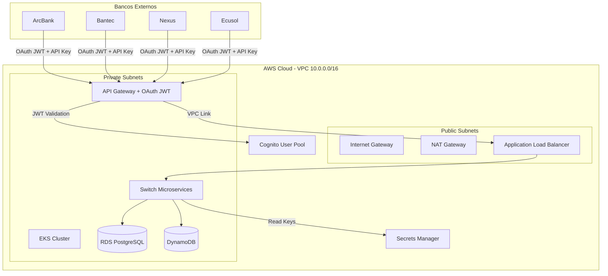

# 🏦 Infraestructura Bancaria AWS - Documentación Completa

**Proyecto:** Switch Transaccional DIGICONECU + 4 Bancos Core  
**Estrategia:** 100% PaaS (Platform as a Service)  
**Región:** us-east-2 (Ohio)  
**Gestión:** Terraform + GitHub Actions
.
---

## 📑 Tabla de Contenidos

1. [Visión General del Proyecto](#-visión-general-del-proyecto)
2. [Arquitectura del Sistema](#-arquitectura-del-sistema)
3. [Estructura de Módulos](#-estructura-de-módulos)
4. [Estado de Implementación](#-estado-de-implementación)
5. [Seguridad Regulatoria](#-seguridad-regulatoria)
6. [Guía de Despliegue](#-guía-de-despliegue)
7. [Instrucciones para Bancos](#-instrucciones-para-bancos)
8. [Operaciones y Mantenimiento](#-operaciones-y-mantenimiento)

---

## 🎯 Visión General del Proyecto

### Contexto

Este ecosistema bancario soporta:
- **4 Bancos:** ArcBank, Bantec, Nexus, Ecusol
- **1 Switch:** DIGICONECU (procesador interbancario)
- **Arquitectura:** Microservicios en contenedores
- **Orquestación:** Amazon EKS + Fargate (serverless)
- **Volumen:** 20-30 transacciones diarias (académico)

### Objetivos Clave

1. **Seguridad Regulatoria:** Cumplimiento de normativas bancarias (OAuth 2.0, API Keys, Firmas Digitales)
2. **Alta Disponibilidad:** Multi-AZ deployment
3. **Costo-Eficiencia:** Uso de servicios PaaS y Free Tier
4. **Escalabilidad:** Arquitectura preparada para crecimiento
5. **Observabilidad:** Monitoreo completo de transacciones

---

## 🏗️ Arquitectura del Sistema

### Diagrama de Alto Nivel



### Capas de Seguridad

| Capa | Tecnología | Propósito |
|------|------------|-----------|
| **Transporte** | TLS 1.2+ | Cifrado HTTPS |
| **Identidad** | OAuth 2.0 (Cognito) | Tokens JWT para M2M |
| **Autorización** | API Keys | Rate limiting y control de acceso |
| **Integridad** | JWS (RS256) | Firmas digitales bidireccionales |
| **Red** | Security Groups | Aislamiento de red Backend ← APIM |

---

## 📦 Estructura de Módulos

### Organización del Código

```
infra-bancaria-terraform/
├── main.tf                    # Orquestador principal
├── provider.tf                # Configuración AWS
├── backend.tf                 # Estado remoto S3
├── variables.tf               # Variables globales
├── outputs.tf                 # Outputs globales
├── INSTRUCCIONES_BANCOS.md    # Guía para bancos
├── SECURITY_IMPLEMENTATION_README.md  # Detalles de seguridad
└── modules/
    ├── networking/            # VPC, Subnets, Security Groups
    ├── iam/                   # Roles EKS y Fargate
    ├── storage/               # ECR y S3
    ├── databases/             # RDS y DynamoDB
    ├── messaging/             # SQS FIFO
    ├── compute/               # EKS + Fargate Profiles
    ├── security-certs/        # Cognito, Secrets, Llaves JWS
    └── api-gateway/           # APIM, OAuth JWT, Circuit Breaker
```

### Módulos Implementados

#### 1. **networking** - Infraestructura de Red
**Recursos:**
- VPC `10.0.0.0/16`
- 4 Subnets (2 públicas + 2 privadas) en 2 AZs
- Internet Gateway + NAT Gateway
- Security Groups estrictos para APIM y Backend

**Archivos:**
- `vpc.tf` - VPC y subnets
- `routes.tf` - Tablas de ruteo
- `security.tf` - Security Groups

#### 2. **iam** - Gestión de Identidad
**Recursos:**
- Rol para EKS Cluster
- Rol para Fargate Execution
- Políticas de acceso a CloudWatch

#### 3. **storage** - Almacenamiento
**Recursos:**
- 5 repositorios ECR (4 bancos + switch)
- 9 buckets S3 para frontends
- Bucket S3 para Truststore mTLS

#### 4. **databases** - Bases de Datos
**Recursos:**
- 5 instancias RDS PostgreSQL (4 bancos + switch)
- Secrets Manager con credenciales auto-generadas
- 5 tablas DynamoDB (directorio + sucursales)

#### 5. **messaging** - Mensajería
**Recursos:**
- Cola FIFO principal (`switch-transferencias-interbancarias.fifo`)
- Dead Letter Queue (DLQ)

#### 6. **compute** - Kubernetes
**Recursos:**
- Clúster EKS `eks-banca-ecosistema`
- 7 Fargate Profiles (4 bancos + switch + kube-system + alb-controller)
- OIDC Provider para IRSA
- Addons: VPC CNI, CoreDNS, Kube-proxy

#### 7. **security-certs** - Seguridad
**Recursos:**
- Cognito User Pool con 4 App Clients
- Llaves RSA del Switch (pública/privada)
- Placeholders para llaves públicas de bancos
- Secreto interno para header `x-origin-secret`

#### 8. **api-gateway** - API Management
**Recursos:**
- API Gateway HTTP con Cognito Authorizer
- VPC Link para conectividad privada
- Application Load Balancer interno
- Truststore S3 con CA auto-generada
- Circuit Breaker (Lambda + DynamoDB + SNS)
- CloudWatch Dashboards y Alarmas

---

## 📊 Estado de Implementación

### Resumen por Fases

| Fase | Componentes | Estado | Progreso |
|------|-------------|--------|----------|
| **Fase 1** | Red, IAM, ECR | ✅ Completa | 100% |
| **Fase 2** | RDS, DynamoDB, SQS, S3 | ✅ Completa | 100% |
| **Fase 3** | EKS, Fargate | ✅ Completa | 100% |
| **Fase 4** | API Gateway, Cognito, Seguridad | ✅ Completa | 100% |
| **Fase 5** | Observabilidad | 🔴 Pendiente | 0% |

### Recursos Desplegados

#### Networking
- ✅ VPC con CIDR `10.0.0.0/16`
- ✅ 4 Subnets en 2 AZs
- ✅ NAT Gateway con EIP
- ✅ Security Groups estrictos

#### Compute
- ✅ EKS Cluster v1.29
- ✅ 7 Fargate Profiles
- ✅ OIDC Provider
- ✅ 4 EKS Addons

#### Databases
- ✅ 5 RDS PostgreSQL (20GB cada una)
- ✅ 5 DynamoDB Tables (PAY_PER_REQUEST)
- ✅ Secrets Manager con credenciales

#### Security
- ✅ Cognito User Pool + 4 Clients
- ✅ API Keys con Usage Plans
- ✅ Llaves JWS (Secrets Manager)
- ✅ API Gateway con JWT Authorizer

---

## 🛡️ Seguridad Regulatoria

### Requisitos Cumplidos

| Requisito | Descripción | Implementación | Costo |
|-----------|-------------|----------------|-------|
| **RNF-SEC-01** | OAuth 2.0 M2M | Cognito User Pool + JWT Authorizer | $0 |
| **RNF-SEC-02** | API Keys | API Gateway + Secrets Manager | $1.60/mes |
| **RNF-SEC-03** | Firma JWS (Entrada) | Secrets Manager + Validación en Switch | $1.60/mes |
| **RNF-SEC-04** | Firma Bidireccional | Llaves RSA del Switch | $0.40/mes |
| **RNF-SEC-05** | Rotación Automática | Terraform `replace` | $0 |

### Flujo de Seguridad

```mermaid
sequenceDiagram
    participant Banco
    participant APIM as API Gateway
    participant Cognito
    participant Switch
    participant Secrets as Secrets Manager
    
    Banco->>Cognito: 1. POST /oauth2/token (Client ID + Secret)
    Cognito-->>Banco: 2. JWT Access Token
    
    Banco->>APIM: 3. POST /transfers + JWT + API Key
    APIM->>APIM: 4. Validar API Key
    APIM->>Cognito: 5. Validar JWT
    Cognito-->>APIM: 6. Token válido
    
    APIM->>APIM: 7. Inyectar header x-origin-secret
    APIM->>Switch: 8. Enviar petición
    
    Switch->>Secrets: 9. Leer llave pública del banco
    Switch->>Switch: 10. Validar firma JWS del body
    Switch->>Switch: 11. Procesar transacción
    Switch->>Secrets: 12. Leer llave privada del Switch
    Switch->>Switch: 13. Firmar respuesta
    Switch-->>APIM: 14. Respuesta firmada
    APIM-->>Banco: 15. Respuesta final
```



### Secrets Manager

| Nombre | Propósito | Valor Inicial |
|--------|-----------|---------------|
| `switch/internal-api-secret-dev` | Header interno | Auto-generado |
| `apim/api-keys/arcbank-key` | API Key ArcBank | Auto-generado |
| `apim/api-keys/bantec-key` | API Key Bantec | Auto-generado |
| `apim/api-keys/nexus-key` | API Key Nexus | Auto-generado |
| `apim/api-keys/ecusol-key` | API Key Ecusol | Auto-generado |
| `apim/jws/arcbank-public-key` | Validar ArcBank | `PENDING_UPLOAD` |
| `apim/jws/bantec-public-key` | Validar Bantec | `PENDING_UPLOAD` |
| `apim/jws/nexus-public-key` | Validar Nexus | `PENDING_UPLOAD` |
| `apim/jws/ecusol-public-key` | Validar Ecusol | `PENDING_UPLOAD` |
| `switch/signing/private-key` | Firmar respuestas | Auto-generado RSA 2048 |
| `switch/signing/public-key` | Compartir con bancos | Auto-generado RSA 2048 |

---

## 🚀 Guía de Despliegue

### Prerequisitos

```bash
# Terraform
terraform --version  # >= 1.0

# AWS CLI
aws --version
aws configure  # Configurar credenciales

# kubectl (para EKS)
kubectl version --client
```

### Despliegue Inicial

```bash
# 1. Clonar repositorio
git clone <repo-url>
cd infra-bancaria-terraform

# 2. Inicializar Terraform
terraform init

# 3. Revisar plan
terraform plan

# 4. Aplicar infraestructura
terraform apply

# 5. Configurar kubectl para EKS
aws eks update-kubeconfig --name eks-banca-ecosistema --region us-east-2
```

### Post-Despliegue (EKS)

Ver guía completa en [`FASE3_EKS_GUIA.md`](./FASE3_EKS_GUIA.md)

```bash
# 1. Parche CoreDNS
kubectl patch deployment coredns \
  -n kube-system \
  --type json \
  -p='[{"op": "remove", "path": "/spec/template/metadata/annotations/eks.amazonaws.com~1compute-type"}]'

# 2. Instalar AWS Load Balancer Controller
helm repo add eks https://aws.github.io/eks-charts
helm install aws-load-balancer-controller eks/aws-load-balancer-controller \
  -n kube-system \
  --set clusterName=eks-banca-ecosistema \
  --set serviceAccount.create=false \
  --set serviceAccount.name=aws-load-balancer-controller
```

### Obtener Credenciales de Cognito

```bash
# Listar User Pools
aws cognito-idp list-user-pools --max-results 10

# Obtener Client IDs
aws cognito-idp list-user-pool-clients \
  --user-pool-id <USER_POOL_ID>

# Obtener Client Secret
aws cognito-idp describe-user-pool-client \
  --user-pool-id <USER_POOL_ID> \
  --client-id <CLIENT_ID> \
  --query 'UserPoolClient.ClientSecret' \
  --output text
```

### Outputs Importantes

```bash
terraform output cognito_endpoint
terraform output cognito_client_ids
terraform output switch_signing_public_key_pem
terraform output apim_gateway_endpoint
```

---

## 📝 Instrucciones para Bancos

### Requisitos de Integración

Cada banco debe proveer los siguientes archivos:

#### 1. Llave Pública JWS
- **Archivo:** `{banco}_public_key.pem`
- **Formato:** PEM (RSA Public Key)
- **Algoritmo:** RSA 2048 (RS256)
- **Propósito:** Validar firmas digitales

#### 2. IPs de Origen (Opcional)
- **Archivo:** `{banco}_ips.txt`
- **Contenido:** Lista de IPs públicas estáticas
- **Propósito:** Whitelisting

### Lo que el Switch entregará

1. **Client ID** de Cognito
2. **Client Secret** de Cognito
3. **API Key** para API Gateway
4. **Token Endpoint:** `https://auth-banca-digiconecu-dev-{random}.auth.us-east-2.amazoncognito.com/oauth2/token`
5. **API Gateway URL:** `https://{api-id}.execute-api.us-east-2.amazonaws.com/dev`
6. **Llave Pública del Switch:** Para validar respuestas firmadas

### Flujo de Autenticación

```bash
# 1. Obtener Token
curl -X POST https://auth-banca.../oauth2/token \
  -u "CLIENT_ID:CLIENT_SECRET" \
  -d "grant_type=client_credentials" \
  -d "scope=https://switch-api.com/transfers.write"

# Respuesta
{
  "access_token": "eyJraWQiOiI...",
  "expires_in": 3600,
  "token_type": "Bearer"
}

# 2. Usar Token en Petición
curl -X POST https://api.switch.com/api/v2/switch/transfers \
  -H "Authorization: Bearer eyJraWQiOiI..." \
  -H "Content-Type: application/json" \
  -H "X-JWS-Signature: <firma_del_body>" \
  --cert client.crt \
  --key client.key \
  -d '{
    "amount": 100.00,
    "from_account": "1234567890",
    "to_account": "0987654321"
  }'
```

---

## 🔧 Operaciones y Mantenimiento

### Gestionar API Keys

```bash
# Ver API Keys
terraform output banco_api_keys

# Obtener API Key desde Secrets Manager
aws secretsmanager get-secret-value \
  --secret-id apim/api-keys/arcbank-key \
  --query SecretString --output text
```

### Actualizar Llaves Públicas JWS

```bash
# Subir llave pública del banco
aws secretsmanager put-secret-value \
  --secret-id apim/jws/arcbank-public-key \
  --secret-string file://arcbank_public_key.pem
```

### Rotación de Credenciales (RNF-SEC-05)

#### API Keys (Cuando sea necesario)

```bash
# Regenerar API Key de un banco
terraform apply -replace='module.api_gateway.aws_apigatewayv2_api_key.banco_api_keys["ArcBank"]'

# Obtener nueva API Key
terraform output -json banco_api_keys | jq -r '.ArcBank'

# Notificar al banco
```

#### Llaves JWS (Cada 180 días)

```bash
# Regenerar llaves del Switch
terraform apply -replace="module.security_identity.tls_private_key.switch_signing_key"

# Exportar nueva llave pública
terraform output switch_signing_public_key_pem > switch_new_public_key.pem

# Enviar a bancos
```

### Monitoreo

#### CloudWatch Dashboards

- **Banca-Overview:** Métricas generales del ecosistema
- **APIM-Metrics:** Latencia, errores 4xx/5xx, throttling
- **Switch-Metrics:** Transacciones procesadas, tasa de éxito

#### Alarmas Configuradas

| Alarma | Métrica | Umbral | Acción |
|--------|---------|--------|--------|
| `APIM-High-5xx-Errors` | 5xx > 10/min | 10 | SNS → Email |
| `APIM-High-Latency` | p99 > 2s | 2000ms | SNS → Slack |
| `Circuit-Breaker-Open` | Estado = OPEN | 1 | SNS → PagerDuty |

### Troubleshooting

#### Error: "Unauthorized" (401)

```bash
# Verificar token
aws cognito-idp get-user --access-token <TOKEN>

# Verificar scopes
jwt decode <TOKEN> | jq '.scope'
```

#### Error: "Forbidden" (403)

```bash
# Verificar certificado mTLS
openssl s_client -connect api.switch.com:443 \
  -cert client.crt \
  -key client.key \
  -showcerts
```

#### Error: "Invalid Signature"

```bash
# Verificar llave pública en Secrets Manager
aws secretsmanager get-secret-value \
  --secret-id apim/jws/arcbank-public-key \
  --query SecretString \
  --output text
```

---

## 💰 Costos Estimados

### Desglose Mensual

| Servicio | Configuración | Costo Mensual |
|----------|---------------|---------------|
| **VPC** | NAT Gateway | $32.40 |
| **EKS** | Control Plane | $72.00 |
| **Fargate** | 7 profiles (0.25 vCPU, 0.5GB) | ~$15.00 |
| **RDS** | 5x db.t3.micro (20GB) | ~$75.00 |
| **DynamoDB** | PAY_PER_REQUEST | ~$2.50 |
| **SQS** | FIFO (1M requests) | ~$0.50 |
| **S3** | 10 buckets (~5GB) | ~$0.15 |
| **Cognito** | User Pool | $0 (Free Tier) |
| **Secrets Manager** | 7 secretos | ~$2.10 |
| **API Gateway** | HTTP API (30 req/día) | ~$0.10 |
| **CloudWatch** | Logs + Dashboards | ~$5.00 |
| **TOTAL** | | **~$204.75/mes** |

### Optimizaciones Posibles

- **Fargate Spot:** Reducir costos de compute en 70%
- **RDS Reserved Instances:** Ahorrar 40% en bases de datos
- **S3 Intelligent-Tiering:** Reducir costos de almacenamiento

---

## 📚 Referencias y Recursos

### Documentación AWS

- [API Gateway HTTP APIs](https://docs.aws.amazon.com/apigateway/latest/developerguide/http-api.html)
- [Cognito OAuth 2.0](https://docs.aws.amazon.com/cognito/latest/developerguide/cognito-user-pools-app-integration.html)
- [EKS Best Practices](https://aws.github.io/aws-eks-best-practices/)
- [Fargate Pricing](https://aws.amazon.com/fargate/pricing/)

### Estándares

- [JWS RFC 7515](https://datatracker.ietf.org/doc/html/rfc7515)
- [OAuth 2.0 RFC 6749](https://datatracker.ietf.org/doc/html/rfc6749)
- [API Keys Best Practices](https://swagger.io/docs/specification/authentication/api-keys/)

### Terraform

- [Terraform AWS Provider](https://registry.terraform.io/providers/hashicorp/aws/latest/docs)
- [Terraform TLS Provider](https://registry.terraform.io/providers/hashicorp/tls/latest/docs)

---

## 👥 Equipo y Contactos

| Rol | Responsable | Fase Asignada |
|-----|-------------|---------------|
| **DevOps Lead** | Stephani Rivera | Fases 1-4 |
| **Kubernetes Team** | [Nombre] | Fase 3 |
| **Security Team** | [Nombre] | Fase 4 |
| **Observability** | [Nombre] | Fase 5 |

---

## 📅 Historial de Versiones

| Versión | Fecha | Cambios |
|---------|-------|---------|
| **3.0** | 2026-01-27 | Consolidación de documentación completa |
| **2.0** | 2026-01-22 | Modularización de código |
| **1.0** | 2026-01-17 | Versión inicial |

---

**Última actualización:** 2026-01-27  
**Proyecto:** infra-bancaria-terraform  
**Autor:** Stephani Rivera (DevOps Lead)
