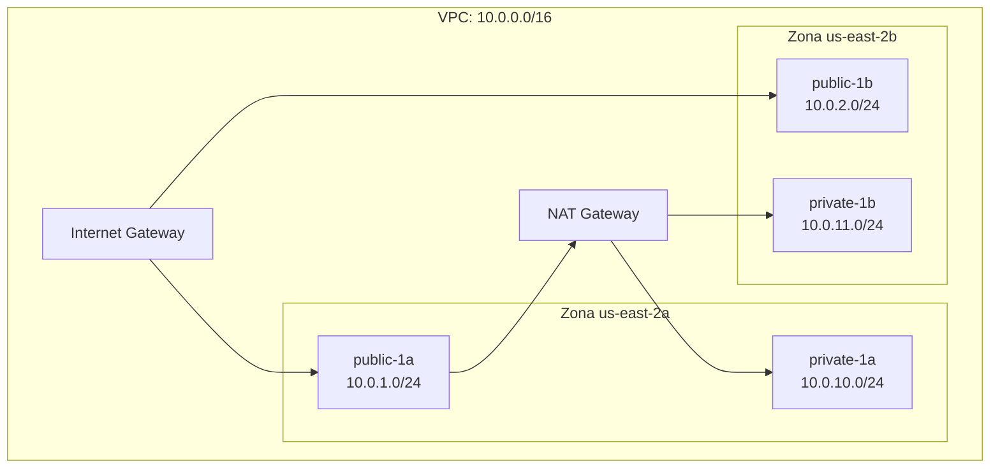
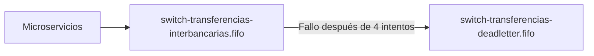
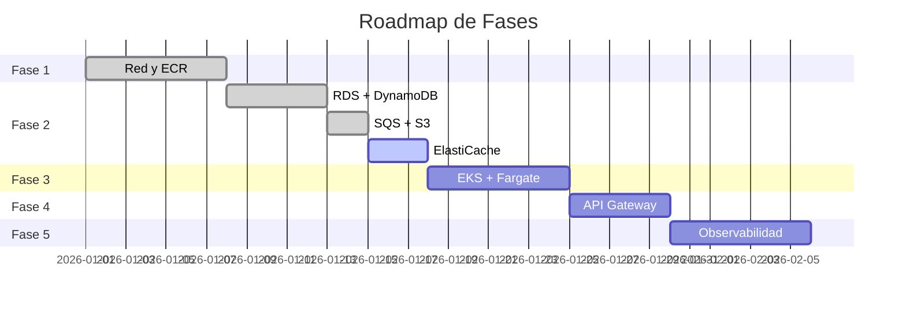

# 📋 Plan de Fases: Ecosistema Bancario AWS

**Proyecto:** Infraestructura Bancaria - 4 Bancos Core + Switch DIGICONECU  
**Estrategia:** 100% PaaS (Platform as a Service)  
**Volumen:** 20-30 transacciones diarias (académico)  
**Gestión:** Terraform + GitHub Actions  
**Región:** us-east-2 (Ohio)

---

## 🎯 Contexto Arquitectónico

Este ecosistema soporta:
- **4 Bancos:** ArcBank, Bantec, Nexus, Ecusol
- **1 Switch:** DIGICONECU (procesador interbancario)
- **Arquitectura:** Microservicios en contenedores
- **Orquestación:** Amazon EKS + Fargate (serverless)

---

## 📊 Estado General del Proyecto

| Fase | Estado | Progreso | Servicios Implementados |
|------|--------|----------|-------------------------|
| **Fase 1** | ✅ **COMPLETA** | 100% | VPC, Subnets, NAT, ECR, IAM |
| **Fase 2** | 🟡 **EN PROGRESO** | 75% | RDS, DynamoDB, SQS, S3 (falta ElastiCache) |
| **Fase 3** | ⚪ **PENDIENTE** | 0% | EKS, Fargate |
| **Fase 4** | ⚪ **PENDIENTE** | 0% | API Gateway, Cognito, Secrets Manager |
| **Fase 5** | ⚪ **PENDIENTE** | 0% | CloudWatch, Prometheus, Grafana, OpenSearch, NiFi |

---

# Fase 1: El Cimiento (Red y Almacenamiento de Imágenes)

## ✅ Estado: COMPLETA

### 🎯 Meta
Tener la "carretera" segura y el lugar donde guardaremos el código de los bancos.

### 📦 Servicios Implementados

#### 1. **VPC - Red Virtual Privada** ([vpc.tf](file:///c:/proyecto-bancario-devops/vpc.tf))



| Recurso | CIDR | Zona | Propósito |
|---------|------|------|-----------|
| **VPC** | `10.0.0.0/16` | - | Red principal (65,536 IPs) |
| **public-1a** | `10.0.1.0/24` | us-east-2a | Load balancers, NAT Gateway |
| **public-1b** | `10.0.2.0/24` | us-east-2b | Alta disponibilidad |
| **private-1a** | `10.0.10.0/24` | us-east-2a | Microservicios, bases de datos |
| **private-1b** | `10.0.11.0/24` | us-east-2b | Alta disponibilidad |
| **Internet Gateway** | - | - | Conexión a internet |

**Tags Especiales:** 
- `kubernetes.io/role/elb = 1` (subnets públicas)
- `kubernetes.io/role/internal-elb = 1` (subnets privadas)

---

#### 2. **Rutas y NAT Gateway** ([routes.tf](file:///c:/proyecto-bancario-devops/routes.tf))

| Recurso | Propósito |
|---------|-----------|
| **Elastic IP** | IP estática para NAT Gateway |
| **NAT Gateway** | Permite salida a internet desde subnets privadas |
| **Route Table Pública** | `0.0.0.0/0` → Internet Gateway |
| **Route Table Privada** | `0.0.0.0/0` → NAT Gateway |

> [!NOTE]
> Los microservicios en subnets privadas pueden descargar dependencias y llamar APIs externas sin estar expuestos directamente.

---

#### 3. **ECR - Repositorios Docker** ([ecr.tf](file:///c:/proyecto-bancario-devops/ecr.tf))

| Repositorio | Banco/Servicio |
|-------------|----------------|
| `arcbank` | Banco ArcBank |
| `bantec` | Banco Bantec |
| `nexus` | Banco Nexus |
| `ecusol` | Banco Ecusol |
| `digiconecu-switch` | Switch interbancario |

**Configuración:**
- ✅ `image_tag_mutability = MUTABLE`
- ✅ `scan_on_push = true` (escaneo de vulnerabilidades)

---

#### 4. **IAM - Roles y Permisos** ([iam.tf](file:///c:/proyecto-bancario-devops/iam.tf))

| Rol | Servicio Asumido | Políticas Adjuntas |
|-----|------------------|-------------------|
| `eks-cluster-role-bancario` | `eks.amazonaws.com` | AmazonEKSClusterPolicy |
| `fargate-execution-role-bancario` | `eks-fargate-pods.amazonaws.com` | AmazonEKSFargatePodExecutionRolePolicy, CloudWatchAgentServerPolicy |

---

#### 5. **Backend Terraform** ([backend.tf](file:///c:/proyecto-bancario-devops/backend.tf))

| Recurso | Nombre | Propósito |
|---------|--------|-----------|
| **S3 Bucket** | `banca-ecosistema-tfstate-512be32e` | Almacenar estado de Terraform |
| **DynamoDB Table** | `terraform-lock-table` | Lock distribuido (prevenir conflictos) |

> [!IMPORTANT]
> El bucket tiene `prevent_destroy = true` para evitar eliminación accidental del estado.

---

### ✅ Checklist Fase 1

- [x] VPC con CIDR `10.0.0.0/16`
- [x] 4 Subnets (2 públicas + 2 privadas) en 2 zonas de disponibilidad
- [x] Internet Gateway
- [x] NAT Gateway con Elastic IP
- [x] Tablas de enrutamiento configuradas
- [x] 5 Repositorios ECR para imágenes Docker
- [x] Roles IAM para EKS y Fargate
- [x] Backend remoto en S3 con lock en DynamoDB
- [x] CI/CD con GitHub Actions ([terraform.yml](file:///c:/proyecto-bancario-devops/.github/workflows/terraform.yml))

---

# Fase 2: Persistencia y Mensajería (Los Datos)

## 🟡 Estado: EN PROGRESO (75%)

### 🎯 Meta
Que los microservicios tengan dónde guardar el dinero y cómo enviarse mensajes.

### 📦 Servicios Implementados

#### 1. **RDS - PostgreSQL** ([rds.tf](file:///c:/proyecto-bancario-devops/rds.tf)) ✅

**Configuración:**

| Entidad | Identificador RDS | Nombre de BD | Storage | Engine |
|---------|-------------------|--------------|---------|--------|
| ArcBank | `rds-arcbank` | `db_arcbank_core` | 20 GB | PostgreSQL 17.6 |
| Bantec | `rds-bantec` | `db_bantec_core` | 20 GB | PostgreSQL 17.6 |
| Nexus | `rds-nexus` | `db_nexus_core` | 20 GB | PostgreSQL 17.6 |
| Ecusol | `rds-ecusol` | `db_ecusol_core` | 20 GB | PostgreSQL 17.6 |
| Switch | `rds-switch` | `db_switch_ledger` | 20 GB | PostgreSQL 17.6 |

**Seguridad:**
- ✅ **Contraseñas:** Generadas automáticamente (16 caracteres) con `random_password`
- ✅ **Secrets Manager:** Credenciales almacenadas en `rds-secret-{entidad}-v1`
- ✅ **Cifrado:** `storage_encrypted = true`
- ✅ **Acceso:** Solo desde VPC interna (`publicly_accessible = false`)
- ✅ **Security Group:** `rds-bancario-sg` permite solo tráfico desde `10.0.0.0/16` en puerto 5432

**Subnet Group:**
- Subnets privadas: `private-1a` y `private-1b`

> [!TIP]
> Cada secreto contiene: `username`, `password`, `engine`, `host`, `port`, `db_name` en formato JSON.

---

#### 2. **DynamoDB - NoSQL** ([dynamodb.tf](file:///c:/proyecto-bancario-devops/dynamodb.tf)) ✅

| Tabla | Hash Key | Propósito | Entidad |
|-------|----------|-----------|---------|
| `switch-directorio-instituciones` | `institucion_id` | Directorio de bancos del switch | Switch DIGICONECU |
| `arcbank-sucursales-geo` | `sucursal_id` | Geolocalización de sucursales | ArcBank |
| `bantec-sucursales-geo` | `sucursal_id` | Geolocalización de sucursales | Bantec |
| `nexus-sucursales-geo` | `sucursal_id` | Geolocalización de sucursales | Nexus |
| `ecusol-sucursales-geo` | `sucursal_id` | Geolocalización de sucursales | Ecusol |

**Configuración:**
- ✅ `billing_mode = PAY_PER_REQUEST` (FinOps: sin costo fijo mensual)
- ✅ Tablas separadas por dominio (cada banco gestiona su propia data)

---

#### 3. **SQS - Colas de Mensajería** ([sqs.tf](file:///c:/proyecto-bancario-devops/sqs.tf)) ✅



| Cola | Tipo | Propósito |
|------|------|-----------|
| `switch-transferencias-interbancarias.fifo` | FIFO | Cola principal para transferencias |
| `switch-transferencias-deadletter.fifo` | FIFO (DLQ) | Mensajes que fallaron 4 veces |

**Configuración:**
- ✅ `fifo_queue = true` (orden garantizado)
- ✅ `content_based_deduplication = true` (sin duplicados)
- ✅ `visibility_timeout = 60s`
- ✅ `maxReceiveCount = 4` (reintentos antes de DLQ)

---

#### 4. **S3 - Almacenamiento de Frontends** ([s3.tf](file:///c:/proyecto-bancario-devops/s3.tf)) ✅

**Buckets Creados:** (9 en total)

| Bucket | Propósito |
|--------|-----------|
| `banca-ecosistema-switch-admin-panel-512be32e` | Panel administrativo del Switch |
| `banca-ecosistema-bantec-web-client-512be32e` | Web banking Bantec |
| `banca-ecosistema-bantec-ventanilla-app-512be32e` | App de ventanilla Bantec |
| `banca-ecosistema-arcbank-web-client-512be32e` | Web banking ArcBank |
| `banca-ecosistema-arcbank-ventanilla-app-512be32e` | App de ventanilla ArcBank |
| `banca-ecosistema-nexus-web-client-512be32e` | Web banking Nexus |
| `banca-ecosistema-nexus-ventanilla-app-512be32e` | App de ventanilla Nexus |
| `banca-ecosistema-ecusol-web-client-512be32e` | Web banking Ecusol |
| `banca-ecosistema-ecusol-ventanilla-app-512be32e` | App de ventanilla Ecusol |

**Seguridad:**
- ✅ Cifrado AES256 en reposo
- ✅ Acceso público bloqueado (`block_public_acls = true`)
- ✅ Políticas públicas bloqueadas

> [!NOTE]
> Estos buckets se integrarán con CloudFront en fases posteriores para servir las SPAs.

---

### ❌ Faltante en Fase 2

#### **ElastiCache (Redis)** - PENDIENTE

**Casos de uso:**
- Caché de sesiones de usuario
- Tokens JWT temporales
- Caché de consultas frecuentes (saldos, últimas transacciones)

**Configuración Propuesta:**
```hcl
# Archivo a crear: elasticache.tf
resource "aws_elasticache_cluster" "redis_sessions" {
  for_each = toset(var.bancos)
  
  cluster_id           = "${each.key}-redis-cache"
  engine               = "redis"
  node_type            = "cache.t3.micro"
  num_cache_nodes      = 1
  parameter_group_name = "default.redis7"
  port                 = 6379
  
  subnet_group_name    = aws_elasticache_subnet_group.redis_group.name
  security_group_ids   = [aws_security_group.redis_sg.id]
}
```

---

### ✅ Checklist Fase 2

- [x] RDS PostgreSQL para 4 bancos + switch (5 instancias)
- [x] Secrets Manager con credenciales RDS
- [x] Security Group para RDS
- [x] DB Subnet Group en subnets privadas
- [x] DynamoDB para directorio del switch
- [x] DynamoDB para sucursales de cada banco (4 tablas)
- [x] SQS FIFO para transferencias interbancarias
- [x] SQS Dead Letter Queue
- [x] S3 buckets para 9 frontends estáticos
- [ ] **ElastiCache Redis (PENDIENTE)**

---

# Fase 3: El Cerebro (Cómputo Serverless)

## ⚪ Estado: PENDIENTE (0%)

### 🎯 Meta
Tener el clúster de Kubernetes listo para ejecutar el código sin gestionar servidores.

### 📦 Servicios a Implementar

#### 1. **Amazon EKS - Clúster de Kubernetes** ❌

**Archivo a crear:** `eks.tf`

```hcl
resource "aws_eks_cluster" "bancario" {
  name     = "eks-banca-ecosistema"
  role_arn = aws_iam_role.eks_cluster_role.arn
  version  = "1.28"

  vpc_config {
    subnet_ids = [
      aws_subnet.private_1a.id,
      aws_subnet.private_1b.id,
      aws_subnet.public_1a.id,
      aws_subnet.public_1b.id
    ]
    endpoint_private_access = true
    endpoint_public_access  = true
  }
}
```

**Componentes:**
- Control plane gestionado por AWS
- Versión recomendada: **1.28** (estable)
- Acceso público y privado habilitado

---

#### 2. **AWS Fargate Profiles** ❌

**Namespaces a crear:**

| Namespace | Contenido |
|-----------|-----------|
| `arcbank` | Microservicios de ArcBank |
| `bantec` | Microservicios de Bantec |
| `nexus` | Microservicios de Nexus |
| `ecusol` | Microservicios de Ecusol |
| `switch` | Microservicios del DIGICONECU Switch |

```hcl
resource "aws_eks_fargate_profile" "bank_profiles" {
  for_each               = toset(concat(var.bancos, ["switch"]))
  cluster_name           = aws_eks_cluster.bancario.name
  fargate_profile_name   = "fargate-${each.key}"
  pod_execution_role_arn = aws_iam_role.fargate_pod_execution.arn

  subnet_ids = [
    aws_subnet.private_1a.id,
    aws_subnet.private_1b.id
  ]

  selector {
    namespace = each.key
  }
}
```

---

#### 3. **Autenticación IAM para EKS** ❌

Los roles ya están creados en [iam.tf](file:///c:/proyecto-bancario-devops/iam.tf), pero falta configurar:

- ConfigMap `aws-auth` para permitir acceso de desarrolladores
- Service Accounts con IRSA (IAM Roles for Service Accounts)

---

### ✅ Checklist Fase 3

- [ ] Crear clúster EKS `eks-banca-ecosistema`
- [ ] Configurar VPC CNI plugin
- [ ] Crear 5 Fargate Profiles (4 bancos + switch)
- [ ] Configurar `aws-auth` ConfigMap
- [ ] Crear Service Accounts con IRSA
- [ ] Instalar AWS Load Balancer Controller
- [ ] Configurar StorageClass para EBS
- [ ] Documentar `kubectl` para acceso al clúster

---

# Fase 4: Seguridad y Puerta de Entrada

## ⚪ Estado: PENDIENTE (0%)

### 🎯 Meta
Controlar quién entra al sistema y proteger las contraseñas de las bases de datos.

### 📦 Servicios a Implementar

#### 1. **API Gateway** ❌

**Archivo a crear:** `apigateway.tf`

**Tipo:** HTTP API (más barato y simple que REST API)

| Gateway | Dominio | Integración |
|---------|---------|-------------|
| `arcbank-api` | `api.arcbank.com` | EKS Service |
| `bantec-api` | `api.bantec.com` | EKS Service |
| `nexus-api` | `api.nexus.com` | EKS Service |
| `ecusol-api` | `api.ecusol.com` | EKS Service |
| `switch-api` | `api.digiconecu.com` | EKS Service |

**Características:**
- Throttling: 100 req/s por IP
- CORS configurado
- Integración con Cognito (autorización JWT)

---

#### 2. **Amazon Cognito** ❌

**Archivo a crear:** `cognito.tf`

**User Pools a crear:** (5 en total)

| User Pool | Propósito |
|-----------|-----------|
| `arcbank-clients` | Clientes web de ArcBank |
| `bantec-clients` | Clientes web de Bantec |
| `nexus-clients` | Clientes web de Nexus |
| `ecusol-clients` | Clientes web de Ecusol |
| `switch-admins` | Administradores del Switch |

**Configuración:**
- MFA opcional (SMS o TOTP)
- Políticas de contraseñas: mínimo 8 caracteres, mayúsculas, números
- Email verification requerido

---

#### 3. **Secrets Manager** ✅ (PARCIALMENTE IMPLEMENTADO)

Ya implementado en [rds.tf](file:///c:/proyecto-bancario-devops/rds.tf) para credenciales RDS.

**Falta agregar:**
- Secretos para API keys externas
- Certificados SSL/TLS
- Tokens de integración de terceros

---

### ✅ Checklist Fase 4

- [x] Secrets Manager para RDS (implementado)
- [ ] API Gateway HTTP APIs (5 instancias)
- [ ] Custom domains para API Gateway
- [ ] Cognito User Pools (5 instancias)
- [ ] Cognito App Clients
- [ ] Lambda Authorizers (si se requiere lógica custom)
- [ ] WAF (Web Application Firewall) para protección DDoS

---

# Fase 5: Inteligencia y Observabilidad (El Cierre)

## ⚪ Estado: PENDIENTE (0%)

### 🎯 Meta
Ver qué está pasando en tiempo real y hacer los cierres bancarios nocturnos.

### 📦 Servicios a Implementar

#### 1. **CloudWatch** ❌

**Archivo a crear:** `cloudwatch.tf`

**Dashboards a crear:**

| Dashboard | Métricas |
|-----------|----------|
| `Banca-Overview` | CPU, RAM, requests/min, errores |
| `ArcBank-Metrics` | Transacciones, saldos, usuarios activos |
| `Bantec-Metrics` | Transacciones, saldos, usuarios activos |
| `Nexus-Metrics` | Transacciones, saldos, usuarios activos |
| `Ecusol-Metrics` | Transacciones, saldos, usuarios activos |
| `Switch-Metrics` | Transferencias procesadas, latencia |

**Alarmas:**
- `RDS-High-CPU` → SNS → Email
- `EKS-Pod-CrashLoopBackOff` → SNS → Slack
- `API-Gateway-5xx-Errors` → SNS → PagerDuty

---

#### 2. **Prometheus + Grafana** ❌

**Instalación:** Helm charts en EKS

```bash
# Prometheus Operator
helm install prometheus prometheus-community/kube-prometheus-stack \
  --namespace monitoring --create-namespace

# Grafana (incluido en el stack)
```

**Dashboards:**
- Kubernetes Cluster Monitoring
- Pod Resource Usage
- Network Traffic Analysis

---

#### 3. **OpenSearch (ElasticSearch)** ❌

**Archivo a crear:** `opensearch.tf`

**Propósito:**
- Logs centralizados de todos los microservicios
- Búsqueda de transacciones por ID, cliente, monto
- Auditoría de operaciones

**Configuración:**
```hcl
resource "aws_opensearch_domain" "logs" {
  domain_name    = "banca-logs"
  engine_version = "OpenSearch_2.11"

  cluster_config {
    instance_type  = "t3.small.search"
    instance_count = 2
  }

  ebs_options {
    ebs_enabled = true
    volume_size = 20
  }

  vpc_options {
    subnet_ids = [aws_subnet.private_1a.id]
    security_group_ids = [aws_security_group.opensearch_sg.id]
  }
}
```

---

#### 4. **Apache NiFi** ❌

**Despliegue:** Docker en ECS Fargate (alternativa a EKS)

**Propósito:**
- **Cierre Diario:** Procesar lote de transacciones a las 00:00
- Generar reportes contables
- ETL: Mover datos historic a S3 Glacier

**Flujos principales:**
1. `Extracción RDS → Validación → Agregación → Reporte PDF → S3`
2. `DynamoDB Stream → Transformación → OpenSearch`

---

### ✅ Checklist Fase 5

- [ ] CloudWatch Dashboards (6 dashboards)
- [ ] CloudWatch Alarmas con SNS
- [ ] Prometheus + Grafana en EKS
- [ ] OpenSearch Domain
- [ ] Fluentd/Fluent Bit para forwarding de logs
- [ ] Apache NiFi en ECS Fargate
- [ ] S3 Glacier para archivado histórico
- [ ] Lambda para triggers de cierre nocturno

---

# 📋 Resumen de Archivos Terraform

| Archivo | Fase | Estado | Servicios |
|---------|------|--------|-----------|
| [provider.tf](file:///c:/proyecto-bancario-devops/provider.tf) | Setup | ✅ | Proveedor AWS |
| [backend.tf](file:///c:/proyecto-bancario-devops/backend.tf) | Setup | ✅ | S3 + DynamoDB Lock |
| [variables.tf](file:///c:/proyecto-bancario-devops/variables.tf) | Setup | ✅ | Variables globales |
| [vpc.tf](file:///c:/proyecto-bancario-devops/vpc.tf) | Fase 1 | ✅ | VPC, Subnets, IGW |
| [routes.tf](file:///c:/proyecto-bancario-devops/routes.tf) | Fase 1 | ✅ | NAT, Route Tables |
| [ecr.tf](file:///c:/proyecto-bancario-devops/ecr.tf) | Fase 1 | ✅ | Repositorios Docker |
| [iam.tf](file:///c:/proyecto-bancario-devops/iam.tf) | Fase 1 | ✅ | Roles EKS/Fargate |
| [rds.tf](file:///c:/proyecto-bancario-devops/rds.tf) | Fase 2 | ✅ | PostgreSQL instances |
| [security.tf](file:///c:/proyecto-bancario-devops/security.tf) | Fase 2 | ✅ | Security Groups |
| [dynamodb.tf](file:///c:/proyecto-bancario-devops/dynamodb.tf) | Fase 2 | ✅ | NoSQL Tables |
| [sqs.tf](file:///c:/proyecto-bancario-devops/sqs.tf) | Fase 2 | ✅ | Colas de mensajería |
| [s3.tf](file:///c:/proyecto-bancario-devops/s3.tf) | Fase 2 | ✅ | Buckets frontends |
| `elasticache.tf` | Fase 2 | ❌ | Redis (falta) |
| `eks.tf` | Fase 3 | ❌ | Clúster Kubernetes |
| `fargate.tf` | Fase 3 | ❌ | Perfiles serverless |
| `apigateway.tf` | Fase 4 | ❌ | HTTP APIs |
| `cognito.tf` | Fase 4 | ❌ | User Pools |
| `cloudwatch.tf` | Fase 5 | ❌ | Dashboards/Alarmas |
| `opensearch.tf` | Fase 5 | ❌ | Logs centralizados |

---

# 🚀 Próximos Pasos Recomendados

## Corto Plazo (Sprint Actual)

1. **Completar Fase 2:**
   - Crear `elasticache.tf` para Redis
   - Actualizar `security.tf` con Security Group para Redis
   - Desplegar con `terraform apply`

## Mediano Plazo (Próximo Sprint)

2. **Iniciar Fase 3:**
   - Crear `eks.tf` con clúster base
   - Configurar `fargate.tf` con 5 perfiles
   - Instalar AWS Load Balancer Controller
   - Probar despliegue de un microservicio de prueba

## Largo Plazo (Roadmap)

3. **Fase 4 y 5:**
   - Implementar API Gateway después de tener microservicios corriendo
   - Cognito cuando se tenga UI funcional
   - Observabilidad en paralelo con desarrollo

---

# 📊 Métricas de Progreso



---

# 📞 Contactos del Equipo

| Rol | Responsable | Fase Asignada |
|-----|-------------|---------------|
| **DevOps Lead** | Stephani Rivera | Fases 1-2 |
| **Kubernetes Team** | [Nombre] | Fase 3 |
| **Security Team** | [Nombre] | Fase 4 |
| **Observability** | [Nombre] | Fase 5 |

---

> **Documento generado:** 2026-01-17  
> **Proyecto:** [proyecto-bancario-devops](file:///c:/proyecto-bancario-devops)  
> **Versión:** 1.0
